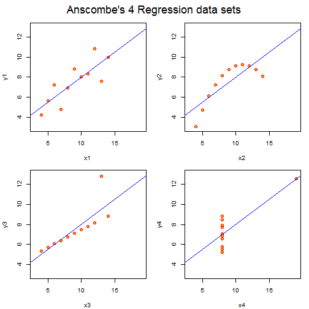

<script type="text/javascript" src="http://cdn.mathjax.org/mathjax/latest/MathJax.js?config=TeX-AMS-MML_HTMLorMML">
</script>
<script type="text/x-mathjax-config">
 MathJax.Hub.Config({
   tex2jax: {inlineMath: [['$','$'], ['\\(','\\)']]}
 });
</script>

R Programming Basics - Block 1
========================================================
author: Joe Tidwell / Jeff Chrabaszcz
date: Thu Mar 13 2014
transition: none
width: 1024
height: 768
font-family: 'Helvetica'

***
<br />
 


RStudio
========================================================

- **I**ntegrated **D**evelopment **E**nvironment for R
- looks like the MATLAB interface
- keeps a lot of information on-screen, avoiding some typing
- saves your graphs!

Console
========================================================

The console is like a sandbox - it's where you can interact with R directly and a good place to troubleshoot code.
Nothing that you write here is saved, though, so you should do most of your coding in the editor and run it from there.

Help me, to help you
========================================================
incremental: true

**How do I...**.


```r
help(functionName)
```

```
No documentation for 'functionName' in specified packages and libraries:
you could try '??functionName'
```

```r
?functionName
```

```
No documentation for 'functionName' in specified packages and libraries:
you could try '??functionName'
```


* Load the help file for the function `help`


```r
?help
```


Getting Around
========================================================

**dir** tells you what files are in your current directory.


```r
dir("~")
```

```
 [1] "a.txt"                                                                    
 [2] "CyberLink"                                                                
 [3] "Default.rdp"                                                              
 [4] "desktop.ini"                                                              
 [5] "dumps"                                                                    
 [6] "IBM"                                                                      
 [7] "MIM2012 Winter 2014 Study Abroad Program EXTENDED DEADLINE OCTOBER 15.msg"
 [8] "My Data Sources"                                                          
 [9] "My Music"                                                                 
[10] "My Pictures"                                                              
[11] "My Shapes"                                                                
[12] "My Videos"                                                                
[13] "OneNote Notebooks"                                                        
[14] "R"                                                                        
```


Getting Around
========================================================

**getwd** tells you your current working directory.
If you're using RStudio, this is the file path to the right of the console label.


```r
getwd()
```

```
[1] "C:/Users/myeong/git/psyc602"
```


Getting Around
========================================================
incremental: true

* **setwd** changes the working directory
* *Windows users must switch backslashes to forward slashes*


```r
setwd("~/myFolderName")
```


* Create a directory on your computer for lab work named "PSYC602_Lab" (Done on your system, not in R)
* Set "PSYC602_Lab" as your working directory


```r
setwd("~/PSYC602_Lab")
```


* You can also do this in the **Session** menu

Getting Around
========================================================

**ls** tells you the objects currently in the R workspace.


```r
ls()
```

```
[1] "ff"   "i"    "lmi"  "mods" "op"  
```


You can also view your objects in the **Environment** tab

Packaging
========================================================

**R** uses a variety of add-on functions found in *packages*.

**install.packages** is self-explanatory.
You only need to install packages once, even though you'll have to load them for each session of R.

* Install these packages


```r
install.packages("plyr")
install.packages("ggplot2")
install.packages("gridExtra")
install.packages("GGally")
install.packages("data.table")
install.packages("car")
install.packages("agricolae")
install.packages("xtable")
```


Loading Packages
========================================================

**library** will load installed packages.
This must be done for each R session.


```r
library(plyr)
```


Variables
========================================================

Variables are named objects that can place or keep data in


```r
a <- 10
a
```

```
[1] 10
```


Data structures
========================================================
incremental: true

* **vector**
  * 1 dimension, $n$ elements long
  * Values are all the *same* class
* **matrix**
  * 2(+) dimensions, $n$ X $m$ elements
  * Values are all the *same* class
* **data.frame**
  * 2(+) dimensions, $n$ X $m$ elements
  * Columns can be *different* classes
  
Vector
========================================================
incremental: true


```r
my.vector <- c(1, 2, 2, 3, 3, 3, 4, 4, 5)
my.vector
```

```
[1] 1 2 2 3 3 3 4 4 5
```

```r

mixed.vec <- c(1, 2, "apple", "banana", 6)
mixed.vec
```

```
[1] "1"      "2"      "apple"  "banana" "6"     
```


Data Frame
========================================================

Create a Data Frame

```r
bacon <- rep(c(0,1), times = 2, each = 2)
pancakes <- rep(c("blueberry","chocolate chip"), each = 4)
breakfast <- data.frame(bacon, pancakes, quality = 1:8)
breakfast
```

```
  bacon       pancakes quality
1     0      blueberry       1
2     0      blueberry       2
3     1      blueberry       3
4     1      blueberry       4
5     0 chocolate chip       5
6     0 chocolate chip       6
7     1 chocolate chip       7
8     1 chocolate chip       8
```


Data Frame
========================================================

Base `R` and `R` packages often have built-in datasets.


```r
data(anscombe)
```


<br />
<br />

*The name of the dataset will be the name of the data.frame!*

Indexing
========================================================

Indexing is how you get either a specific value, or subset of values, from your variable.

How different variables are indexed depends on the variable type, and what data you want to retrieve.

- square braces, []
- dollar sign, $
- at symbol, @
  - we won't really use @ very much, if at all

vectors
========================================================


```r
my.vector
```

```
[1] 1 2 2 3 3 3 4 4 5
```

```r
my.vector[4]
```

```
[1] 3
```


```r
my.vector[1:4]
```

```
[1] 1 2 2 3
```


data.frame
========================================================


```r
data(anscombe)
my.data <- anscombe
head(my.data)
```

```
  x1 x2 x3 x4   y1   y2    y3   y4
1 10 10 10  8 8.04 9.14  7.46 6.58
2  8  8  8  8 6.95 8.14  6.77 5.76
3 13 13 13  8 7.58 8.74 12.74 7.71
4  9  9  9  8 8.81 8.77  7.11 8.84
5 11 11 11  8 8.33 9.26  7.81 8.47
6 14 14 14  8 9.96 8.10  8.84 7.04
```


data.frame
========================================================


```r
my.data$x1
```

```
 [1] 10  8 13  9 11 14  6  4 12  7  5
```


data.frame
========================================================


```r
names.col <- c("y1","x1")
 
my.data <- anscombe[,names.col]
head(my.data)
```

```
    y1 x1
1 8.04 10
2 6.95  8
3 7.58 13
4 8.81  9
5 8.33 11
6 9.96 14
```


data.frame
========================================================


```r
head(my.data)
```

```
    y1 x1
1 8.04 10
2 6.95  8
3 7.58 13
4 8.81  9
5 8.33 11
6 9.96 14
```


data.frames
========================================================


```r
my.data$x1[1]
```

```
[1] 10
```


data.frames
========================================================


```r
my.data[1] 
```

```
      y1
1   8.04
2   6.95
3   7.58
4   8.81
5   8.33
6   9.96
7   7.24
8   4.26
9  10.84
10  4.82
11  5.68
```


data.frames
========================================================


```r
my.data[,1]  
```

```
 [1]  8.04  6.95  7.58  8.81  8.33  9.96  7.24  4.26 10.84  4.82  5.68
```


data.frames
========================================================


```r
head(my.data[-2]) 
```

```
    y1
1 8.04
2 6.95
3 7.58
4 8.81
5 8.33
6 9.96
```


```r
my.data[2,2] 
```

```
[1] 8
```


Functions 
========================================================

Take some input, produce an output


```r
a <- 1:5
mean(a)
```

```
[1] 3
```

```r
mean(1,2,3,4,5)
```

```
[1] 1
```


Data Interrogation
========================================================

- many ways to *see* data
- usually you don't want all of it at once
- sometimes you want some kind of summary or description


discovering structure
========================================================


```r
summary(my.data)
```

```
       y1              x1      
 Min.   : 4.26   Min.   : 4.0  
 1st Qu.: 6.32   1st Qu.: 6.5  
 Median : 7.58   Median : 9.0  
 Mean   : 7.50   Mean   : 9.0  
 3rd Qu.: 8.57   3rd Qu.:11.5  
 Max.   :10.84   Max.   :14.0  
```


seeing raw data
========================================================


```r
head(my.data)
```

```
    y1 x1
1 8.04 10
2 6.95  8
3 7.58 13
4 8.81  9
5 8.33 11
6 9.96 14
```


**tail(breakfast)** also works, with predictable results

Reading data
========================================================

Read text files


```
Error in file(file, "rt") : cannot open the connection
```
