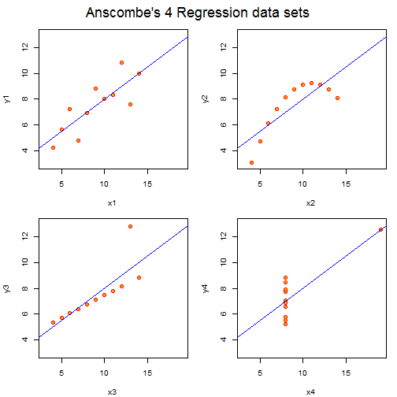

<script type="text/javascript"
       src="http://cdn.mathjax.org/mathjax/latest/MathJax.js?config=TeX-AMS-MML_HTMLorMML">
</script>
<script type="text/x-mathjax-config">
 MathJax.Hub.Config({
   tex2jax: {inlineMath: [['$','$'], ['\\(','\\)']]}
 });
</script>

ANOVA Stuff I
========================================================
author: Jeff/Joe
date: Sun Mar 02 2014
transition: none
font-family: 'Helvetica'

***
<br />
 


Load Some Data
===
* Load Data

```r
library(reshape2)
my.dat <- ChickWeight[,c("weight","Diet")]
summary(my.dat)
```

```
     weight    Diet   
 Min.   : 35   1:220  
 1st Qu.: 63   2:120  
 Median :103   3:120  
 Mean   :122   4:118  
 3rd Qu.:164          
 Max.   :373          
```


Fixed Effect Model
===
incremental: true

$Y_{i(j)} = \mu + \alpha_j + \varepsilon_{i(j)}$ 

$\mu = \sum\frac{\mu_j}{a}$, $\alpha_j = \mu_j-\mu$

* Null Hypothesis
  * $H_0: \alpha_j=0, j=1\ldots k$
* Error
  * $\varepsilon_{i(j)} \sim N(0,\sigma^2)$
* Regression (linear) Model
  * $y = \beta_0 + \beta_1X + \varepsilon$


ANOVA - 'By Hand'
===
incremental: true

$F=\frac{MS_{Between}}{MS_{Within}}$

* $SS_B$

$\sum n_j\left(\overline{Y}_{\cdot j}-\overline{Y}_{\cdot\cdot}\right)^2$


```r
gm <- mean(my.dat$weight)
a <- aggregate(weight~Diet,
               data=my.dat, mean)
names(a) <- c("Diet","mean.j")
a$hat <- a$mean.j-gm
a$n <- table(my.dat$Diet)
SSB <- sum(a$hat^2*a$n)
```


ANOVA - 'By Hand'
===
incremental: true

$F=\frac{MS_{Between}}{MS_{Within}}$

* $SS_W$

$\sum \sum \left(Y_{ij} - \overline{Y}_{\cdot j} \right)^2$


```r
SSW <- sum(apply(my.dat, 
                 1, 
                 function(x)(a[a$Diet==x['Diet'],]$mean.j - as.numeric(x['weight']))^2 ))
```


ANOVA - 'By Hand'
===
incremental: true

$F=\frac{MS_{Between}}{MS_{Within}}$

* Degrees of Freedom

$df_B = a - 1 \\ df_W = N - a$

```r
df.B <- length(levels(my.dat$Diet))-1
df.W <- nrow(my.dat) - df.B - 1
```


ANOVA - 'By Hand'
===
incremental: true

$F=\frac{MS_{Between}}{MS_{Within}}$

* Mean Squares

$MS_B = \frac{SS_B}{df_B} \\ MS_W = \frac{SS_W}{df_W}$

```r
MSB <- SSB/df.B
MSW <- SSW/df.W
F.stat <- MSB/MSW
```


ANOVA - 'By Hand'
===
incremental: true

$F=\frac{MS_{Between}}{MS_{Within}}$ ... Finally


```r
F.stat <- MSB/MSW
F.stat
```

```
[1] 10.8
```


$p$-level

```r
p.level = 1-pf(F.stat,df.B,df.W)
p.level
```

```
[1] 6.43e-07
```


ANOVA - Compare
===
incremental:true

<small>

```r
c(F=F.stat,p=p.level)
```

```
       F        p 
1.08e+01 6.43e-07 
```

```r
fit1 <- lm(weight~Diet, my.dat)
anova(fit1)
```

```
Analysis of Variance Table

Response: weight
           Df  Sum Sq Mean Sq F value  Pr(>F)    
Diet        3  155863   51954    10.8 6.4e-07 ***
Residuals 574 2758693    4806                    
---
Signif. codes:  0 '***' 0.001 '**' 0.01 '*' 0.05 '.' 0.1 ' ' 1
```

</small>

Bonferroni Correction
===
incremental: true

$P(T\geq t_i|H_0) \leq \frac{\alpha}{n}, i=1\ldots n$

$\Rightarrow P(T\geq t_i|H_0)n \leq \alpha, i=1\ldots n$

So... if $\alpha=.05$, and you make 10 comparisons, whats the comparison level critical value?

$\frac{.05}{10} = .005$

Now assume for one of your comparisons, you obtain $p=.008$, how could you transform this $p$-value to use $\alpha=.05$ as your critical value?
 
$p_{adj} = .008*10 =.08 \\ .08 \gt \alpha  \\ \Rightarrow \mbox{Fail to reject } H_0$

Bonferroni Correction
===
incremental: true
<small>
Uncorrected pairwise comparisons


```r
mc.none <- with(my.dat,  
                pairwise.t.test(weight, Diet, 
                                p.adj="none"))
mc.none
```

```

	Pairwise comparisons using t tests with pooled SD 

data:  weight and Diet 

  1       2     3    
2 0.011   -     -    
3 4.1e-07 0.023 -    
4 4.3e-05 0.160 0.393

P value adjustment method: none 
```

</small>

Bonferroni Correction
===
incremental: true
<small>
Bonferroni corrected pairwise comparisons


```r
mc.bonf <- with(my.dat, 
                pairwise.t.test(weight, Diet, 
                                p.adj="bonf"))
mc.bonf
```

```

	Pairwise comparisons using t tests with pooled SD 

data:  weight and Diet 

  1       2       3      
2 0.06838 -       -      
3 2.5e-06 0.14077 -      
4 0.00026 0.95977 1.00000

P value adjustment method: bonferroni 
```

</small>


Bonferroni Correction - 'By Hand'
===
incremental: true
<small>
\# of comparisons $= k(k-1)/2$


```r
k <- length(levels(my.dat$Diet))
n.c <- k*(k-1)/2
n.c
```

```
[1] 6
```

```r
mc.none$p.value <- mc.none$p.value*n.c
```

</small>


Bonferroni Correction - 'By Hand'
===
incremental: true
<small>
\# of comparisons $= k(k-1)/2$


```r
mc.none$p.value <- mc.bonf$p.value
```

</small>


