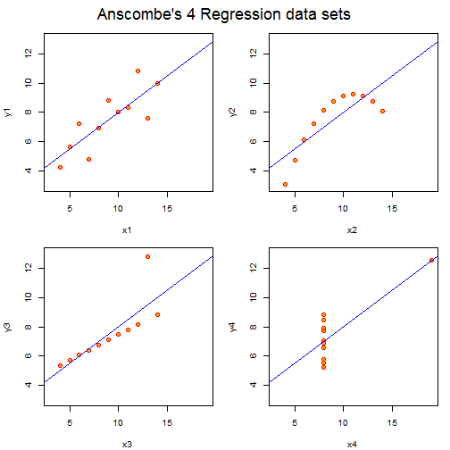

<script type="text/javascript"
       src="http://cdn.mathjax.org/mathjax/latest/MathJax.js?config=TeX-AMS-MML_HTMLorMML">
</script>
<script type="text/x-mathjax-config">
 MathJax.Hub.Config({
   tex2jax: {inlineMath: [['$','$'], ['\\(','\\)']]}
 });
</script>

ANOVA Stuff II
========================================================
author: Joe/Jeff
date: Sun Mar 02 2014
transition: none
font-family: 'Helvetica'

***
<br />
 


Load Some Data
===
* Load Data

```r
library(reshape2)
my.dat <- ChickWeight[,c("weight","Diet")]
summary(my.dat)
```

```
     weight    Diet   
 Min.   : 35   1:220  
 1st Qu.: 63   2:120  
 Median :103   3:120  
 Mean   :122   4:118  
 3rd Qu.:164          
 Max.   :373          
```


Fixed Versus Random
===
incremental: false
left: 50%

Fixed Effect 
  * $Y_{ij} = \mu + \alpha_j + \varepsilon_{ij}$
  * $Yij \sim N(\mu, \sigma^2)$
  * $H_0: \alpha_j=0, j=1\ldots k$
  * $\alpha_j = \mu_j - \mu$
  * $\varepsilon_{ij} \sim N(0,\sigma^2)$

***

Random Effect
  * $Y_{ij} = \mu + \alpha_j + \varepsilon_{ij}$
  * $Yij \sim N(\mu, \sigma^2_{\alpha} + \sigma^2)$
  * $H_0: \sigma^2_{\alpha_j} = 0$
  * $\alpha_j \sim N(0,\sigma^2_{\alpha})$
  * $\varepsilon_{ij} \sim N(0,\sigma^2)$

Data
===

```r
options(contrasts=c("contr.sum","contr.poly"))
mydat <- ChickWeight
head(mydat)
```

```
  weight Time Chick Diet
1     42    0     1    1
2     51    2     1    1
3     59    4     1    1
4     64    6     1    1
5     76    8     1    1
6     93   10     1    1
```


Fixed
===


```r
fit1 <- weight~Diet
summary(aov(fit1, mydat))
```

```
             Df  Sum Sq Mean Sq F value  Pr(>F)    
Diet          3  155863   51954    10.8 6.4e-07 ***
Residuals   574 2758693    4806                    
---
Signif. codes:  0 '***' 0.001 '**' 0.01 '*' 0.05 '.' 0.1 ' ' 1
```


Random?
===


```r
fit2 <- weight~Error(Diet)
summary(aov(fit2, mydat))
```

```

Error: Diet
          Df Sum Sq Mean Sq F value Pr(>F)
Residuals  3 155863   51954               

Error: Within
           Df  Sum Sq Mean Sq F value Pr(>F)
Residuals 574 2758693    4806               
```


Random
===


```r
fit3 <- weight~Diet+Error(1/Diet)
summary(aov(fit3, mydat))
```

```

Error: Within
           Df  Sum Sq Mean Sq F value  Pr(>F)    
Diet        3  155863   51954    10.8 6.4e-07 ***
Residuals 574 2758693    4806                    
---
Signif. codes:  0 '***' 0.001 '**' 0.01 '*' 0.05 '.' 0.1 ' ' 1
```


Random
===


```r
fit4 <- weight~+Error(Chick/Diet)
summary(aov(fit4, mydat))
```

```

Error: Chick
          Df Sum Sq Mean Sq F value Pr(>F)
Residuals 49 530105   10818               

Error: Within
           Df  Sum Sq Mean Sq F value Pr(>F)
Residuals 528 2384450    4516               
```


Scheffe's Test 
===
*Corrects for All Possible Contrasts!!!*
<small>

```r
library(agricolae)
mc.scheffe <- scheffe.test(aov(fit1,mydat),"Diet", group=FALSE, console=TRUE)
```

```

Study: aov(fit1, mydat) ~ "Diet"

Scheffe Test for weight 

Mean Square Error  : 4806 

Diet,  means

  weight  std   r Min Max
1    103 56.7 220  35 305
2    123 71.6 120  39 331
3    143 86.5 120  39 373
4    135 68.8 118  39 322

alpha: 0.05 ; Df Error: 574 
Critical Value of F: 2.62 

Harmonic Mean of Cell Sizes  135
Comparison between treatments means

      Difference   pvalue sig   LCL    UCL
1 - 2     -19.97 0.093138   . -42.8   2.85
1 - 3     -40.30 0.000011 *** -63.1 -17.49
1 - 4     -32.62 0.000788 *** -55.6  -9.68
2 - 3     -20.33 0.161627     -46.3   5.62
2 - 4     -12.65 0.576978     -38.7  13.42
3 - 4       7.69 0.865720     -18.4  33.75
```

```r
mc.scheffe$comparison
```

```
      Difference   pvalue sig   LCL    UCL
1 - 2     -19.97 0.093138   . -42.8   2.85
1 - 3     -40.30 0.000011 *** -63.1 -17.49
1 - 4     -32.62 0.000788 *** -55.6  -9.68
2 - 3     -20.33 0.161627     -46.3   5.62
2 - 4     -12.65 0.576978     -38.7  13.42
3 - 4       7.69 0.865720     -18.4  33.75
```

</small>

Bonferoni
===
<small>

```r
mc.bonf <- with(mydat, 
                pairwise.t.test(weight, Diet, 
                                p.adj="bonf"))
mc.bonf
```

```

	Pairwise comparisons using t tests with pooled SD 

data:  weight and Diet 

  1       2       3      
2 0.06838 -       -      
3 2.5e-06 0.14077 -      
4 0.00026 0.95977 1.00000

P value adjustment method: bonferroni 
```

</small>

===
<small>

```r
mc.scheffe$comparison
```

```
      Difference   pvalue sig   LCL    UCL
1 - 2     -19.97 0.093138   . -42.8   2.85
1 - 3     -40.30 0.000011 *** -63.1 -17.49
1 - 4     -32.62 0.000788 *** -55.6  -9.68
2 - 3     -20.33 0.161627     -46.3   5.62
2 - 4     -12.65 0.576978     -38.7  13.42
3 - 4       7.69 0.865720     -18.4  33.75
```

```r
mc.bonf
```

```

	Pairwise comparisons using t tests with pooled SD 

data:  weight and Diet 

  1       2       3      
2 0.06838 -       -      
3 2.5e-06 0.14077 -      
4 0.00026 0.95977 1.00000

P value adjustment method: bonferroni 
```

</small>
