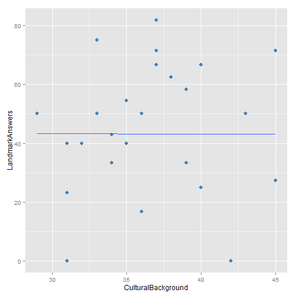
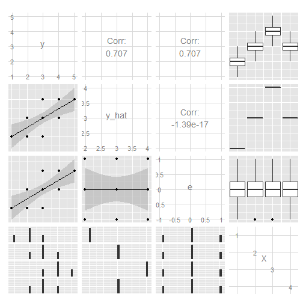
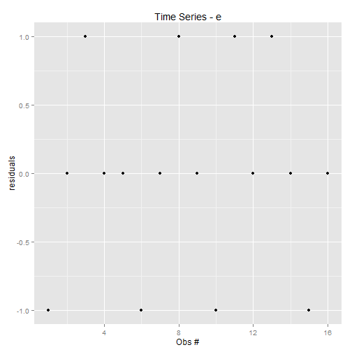

Homework 1
========================================================

Myeong Lee
--------------------------------------------------------
  
### Task 1
  
##### H0 in formal expression

$\rho = \frac{\sum(z_y Z_X)}{N} = 0$

##### H0 in words expression
- There is no relationship between X and y in the population. Any difference from zero found in the sample is due to chance or random factors.


### Task 2
  
##### H1 in formal expression
$\rho = \frac{\sum(z_y Z_X)}{N} \neq 0$

##### H1 in words expression
- There is a positive or negative relationship between X and y in the population. 


### Task 3: Margin of error $\alpha$

```r
data1 <- read.csv("C:/Users/myeong/Desktop/hw1.csv")
data1
```

```
##    y X
## 1 17 1
## 2 27 2
## 3 29 3
## 4 29 4
## 5 38 5
## 6 39 6
## 7 45 7
```

```r
rz.ci <- function(N, conf.level = 0.95) {
    zr.se <- 1/(N - 3)^0.5
    moe <- qnorm(1 - (1 - conf.level)/2) * zr.se
}

rz.ci(nrow(data1), 0.95)[1]
```

```
## [1] 0.98
```


### Task 4: Regression

```r
fit1 <- lm(y ~ X, data = data1)
summary(fit1)
```

```
## 
## Call:
## lm(formula = y ~ X, data = data1)
## 
## Residuals:
##      1      2      3      4      5      6      7 
## -2.464  3.357  1.179 -3.000  1.821 -1.357  0.464 
## 
## Coefficients:
##             Estimate Std. Error t value Pr(>|t|)    
## (Intercept)   15.286      2.175    7.03  0.00090 ***
## X              4.179      0.486    8.59  0.00035 ***
## ---
## Signif. codes:  0 '***' 0.001 '**' 0.01 '*' 0.05 '.' 0.1 ' ' 1
## 
## Residual standard error: 2.57 on 5 degrees of freedom
## Multiple R-squared:  0.937,	Adjusted R-squared:  0.924 
## F-statistic: 73.8 on 1 and 5 DF,  p-value: 0.000352
```

```r

fit2 <- update(fit1, scale(y) ~ scale(X))
summary(fit2)
```

```
## 
## Call:
## lm(formula = scale(y) ~ scale(X), data = data1)
## 
## Residuals:
##       1       2       3       4       5       6       7 
## -0.2642  0.3599  0.1264 -0.3216  0.1953 -0.1455  0.0498 
## attr(,"scaled:center")
## [1] 32
## attr(,"scaled:scale")
## [1] 9.33
## 
## Coefficients:
##             Estimate Std. Error t value Pr(>|t|)    
## (Intercept) 2.49e-16   1.04e-01    0.00  1.00000    
## scale(X)    9.68e-01   1.13e-01    8.59  0.00035 ***
## ---
## Signif. codes:  0 '***' 0.001 '**' 0.01 '*' 0.05 '.' 0.1 ' ' 1
## 
## Residual standard error: 0.276 on 5 degrees of freedom
## Multiple R-squared:  0.937,	Adjusted R-squared:  0.924 
## F-statistic: 73.8 on 1 and 5 DF,  p-value: 0.000352
```


### Task 5: Raw-score and the Standardized Prediction Equation

##### Raw-score Prediction Equation

- Y = 15.286 + 4.179X + e

##### Standardized Prediction Equation

- Y = 0.968X  


### Task 6: Time-series plots of y and e

##### y - observation number

```r
library(ggplot2)
data1$e <- residuals(fit1)
data1$y.hat <- fitted(fit1)

qplot(1:nrow(data1), y, data = data1, main = "Time Series - y", xlab = "Obs #", 
    ylab = "Values")
```

 


##### e - observation number

```r
qplot(1:nrow(data1), e, data = data1, main = "Time Series - e", xlab = "Obs #", 
    ylab = "residuals")
```

 


### Task 7: data.frame with y, X, y_hat, and e for each observation


```r
frame1 <- data.frame(y = data1$y, X = data1$X, y_hat = data1$y.hat, e = data1$e)
frame1
```

```
##    y X y_hat       e
## 1 17 1 19.46 -2.4643
## 2 27 2 23.64  3.3571
## 3 29 3 27.82  1.1786
## 4 29 4 32.00 -3.0000
## 5 38 5 36.18  1.8214
## 6 39 6 40.36 -1.3571
## 7 45 7 44.54  0.4643
```


### Task 8: Correlations

```r
library(xtable)

my.cor <- cor(data1)
print(xtable(my.cor), type = "html")
```

<!-- html table generated in R 3.0.2 by xtable 1.7-1 package -->
<!-- Thu Feb 06 23:28:04 2014 -->
<TABLE border=1>
<TR> <TH>  </TH> <TH> y </TH> <TH> X </TH> <TH> e </TH> <TH> y.hat </TH>  </TR>
  <TR> <TD align="right"> y </TD> <TD align="right"> 1.00 </TD> <TD align="right"> 0.97 </TD> <TD align="right"> 0.25 </TD> <TD align="right"> 0.97 </TD> </TR>
  <TR> <TD align="right"> X </TD> <TD align="right"> 0.97 </TD> <TD align="right"> 1.00 </TD> <TD align="right"> -0.00 </TD> <TD align="right"> 1.00 </TD> </TR>
  <TR> <TD align="right"> e </TD> <TD align="right"> 0.25 </TD> <TD align="right"> -0.00 </TD> <TD align="right"> 1.00 </TD> <TD align="right"> -0.00 </TD> </TR>
  <TR> <TD align="right"> y.hat </TD> <TD align="right"> 0.97 </TD> <TD align="right"> 1.00 </TD> <TD align="right"> -0.00 </TD> <TD align="right"> 1.00 </TD> </TR>
   </TABLE>


### Task 9: Pairwise scatter plots and correlations

```r
library(GGally)
```

```
## Loading required package: reshape
## Loading required package: plyr
## 
## Attaching package: 'reshape'
## 
## The following objects are masked from 'package:plyr':
## 
##     rename, round_any
```

```r

ggpairs(data1, lower = list(continuous = "smooth"))
```

 


### Task 10: Intercorrelations found

- y and X are closely, positively correlated with the coeff 0.97.
- y and e are loosely correlated with the coeff 0.25.
- y.hat and y are very closely correlated (coeff 0.968) since the error is very small in this regression.
- X and y.hat are perfectly correlated since they are predicted values.
- X and e are not correlated (coeff=0) by definition.
- e and y.hat are not correlated by definition.

### Task 11: Interpret the Results


```r
anova(fit1)
```

```
## Analysis of Variance Table
## 
## Response: y
##           Df Sum Sq Mean Sq F value  Pr(>F)    
## X          1    489     489    73.8 0.00035 ***
## Residuals  5     33       7                    
## ---
## Signif. codes:  0 '***' 0.001 '**' 0.01 '*' 0.05 '.' 0.1 ' ' 1
```

- In the hypothesis test, F-value is 73.835 and the significance level is very high, satisfying 0.04% significance level. 


