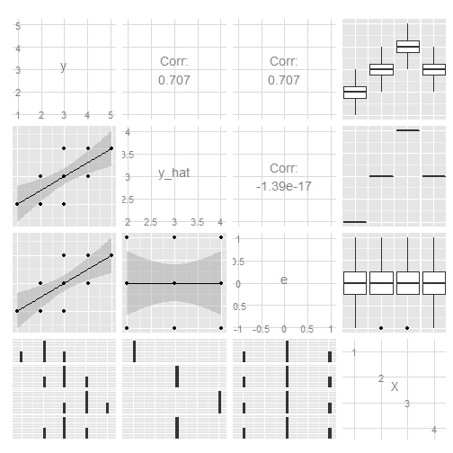
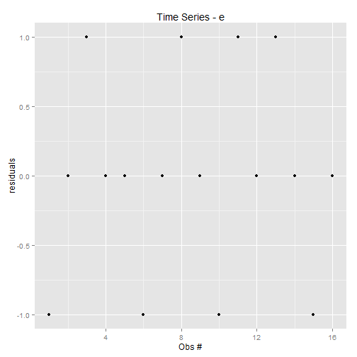

Homework 2
========================================================

Myeong Lee
--------------------------------------------------------
  
### Task 1
  
##### H0 in formal expression

$H_0: R^2 = 0$

##### H0 in words expression
- There is no relationship between $X_1$, $X_2$, $X_3$ and y in the population. $X_1$, $X_2$, $X_3$ do not predict y in the population.


### Task 2
  
##### H1 in formal expression
$H_1: R^2 > 0$

##### H1 in words expression
- There is a positive or negative relationship between $X_1$, $X_2$, $X_3$ and y in the population. $X_1$, $X_2$, $X_3$ do predict y in the population.


### Task 3: Error Rate $\alpha$
$\alpha = P(P|H_0) = 0.05$ 


### Task 4: Full-model Regression

```r
data1 <- read.csv("C:/Users/myeong/Desktop/hw2.csv")
fit1 <- lm(y ~ X1 + X2 + X3, data = data1)
summary(fit1)
```

```
## 
## Call:
## lm(formula = y ~ X1 + X2 + X3, data = data1)
## 
## Residuals:
##      1      2      3      4      5      6      7 
## -2.126 -0.190 -0.735  4.978  3.042 -4.373 -0.596 
## 
## Coefficients:
##             Estimate Std. Error t value Pr(>|t|)  
## (Intercept)    1.190      7.176    0.17    0.879  
## X1             3.965      0.852    4.66    0.019 *
## X2             1.421      2.842    0.50    0.651  
## X3             4.129      2.285    1.81    0.169  
## ---
## Signif. codes:  0 '***' 0.001 '**' 0.01 '*' 0.05 '.' 0.1 ' ' 1
## 
## Residual standard error: 4.42 on 3 degrees of freedom
## Multiple R-squared:  0.916,	Adjusted R-squared:  0.832 
## F-statistic: 10.9 on 3 and 3 DF,  p-value: 0.0401
```

```r

fit2 <- update(fit1, scale(y) ~ scale(X1) + scale(X2) + scale(X3))
summary(fit2)
```

```
## 
## Call:
## lm(formula = scale(y) ~ scale(X1) + scale(X2) + scale(X3), data = data1)
## 
## Residuals:
##       1       2       3       4       5       6       7 
## -0.1969 -0.0176 -0.0680  0.4610  0.2817 -0.4050 -0.0552 
## attr(,"scaled:center")
## [1] 29.6
## attr(,"scaled:scale")
## [1] 10.8
## 
## Coefficients:
##             Estimate Std. Error t value Pr(>|t|)  
## (Intercept) 5.05e-17   1.55e-01    0.00    1.000  
## scale(X1)   7.93e-01   1.70e-01    4.66    0.019 *
## scale(X2)   1.07e-01   2.15e-01    0.50    0.651  
## scale(X3)   3.82e-01   2.12e-01    1.81    0.169  
## ---
## Signif. codes:  0 '***' 0.001 '**' 0.01 '*' 0.05 '.' 0.1 ' ' 1
## 
## Residual standard error: 0.409 on 3 degrees of freedom
## Multiple R-squared:  0.916,	Adjusted R-squared:  0.832 
## F-statistic: 10.9 on 3 and 3 DF,  p-value: 0.0401
```


### Task 5: Sub-model Regression

##### X1 and X2 

```r
sub.fit1 <- lm(y ~ X1 + X2, data = data1)
summary(sub.fit1)
```

```
## 
## Call:
## lm(formula = y ~ X1 + X2, data = data1)
## 
## Residuals:
##       1       2       3       4       5       6       7 
## -3.3492  0.6508  3.3175  3.9841 -0.0159 -8.3492  3.7619 
## 
## Coefficients:
##             Estimate Std. Error t value Pr(>|t|)  
## (Intercept)    0.349      8.961    0.04    0.971  
## X1             3.889      1.064    3.65    0.022 *
## X2             4.556      2.816    1.62    0.181  
## ---
## Signif. codes:  0 '***' 0.001 '**' 0.01 '*' 0.05 '.' 0.1 ' ' 1
## 
## Residual standard error: 5.53 on 4 degrees of freedom
## Multiple R-squared:  0.825,	Adjusted R-squared:  0.738 
## F-statistic: 9.44 on 2 and 4 DF,  p-value: 0.0306
```

```r

sub.fit2 <- update(sub.fit1, scale(y) ~ scale(X1) + scale(X2))
summary(sub.fit2)
```

```
## 
## Call:
## lm(formula = scale(y) ~ scale(X1) + scale(X2), data = data1)
## 
## Residuals:
##        1        2        3        4        5        6        7 
## -0.31014  0.06026  0.30720  0.36893 -0.00147 -0.77314  0.34836 
## attr(,"scaled:center")
## [1] 29.6
## attr(,"scaled:scale")
## [1] 10.8
## 
## Coefficients:
##             Estimate Std. Error t value Pr(>|t|)  
## (Intercept) 6.53e-17   1.94e-01    0.00    1.000  
## scale(X1)   7.78e-01   2.13e-01    3.65    0.022 *
## scale(X2)   3.44e-01   2.13e-01    1.62    0.181  
## ---
## Signif. codes:  0 '***' 0.001 '**' 0.01 '*' 0.05 '.' 0.1 ' ' 1
## 
## Residual standard error: 0.512 on 4 degrees of freedom
## Multiple R-squared:  0.825,	Adjusted R-squared:  0.738 
## F-statistic: 9.44 on 2 and 4 DF,  p-value: 0.0306
```


##### X1 and X3

```r
sub.fit1 <- lm(y ~ X1 + X3, data = data1)
summary(sub.fit1)
```

```
## 
## Call:
## lm(formula = y ~ X1 + X3, data = data1)
## 
## Residuals:
##      1      2      3      4      5      6      7 
## -2.619  0.686 -1.356  4.255  4.387 -3.829 -1.524 
## 
## Coefficients:
##             Estimate Std. Error t value Pr(>|t|)   
## (Intercept)    3.751      4.530    0.83   0.4542   
## X1             4.042      0.755    5.35   0.0059 **
## X3             4.826      1.631    2.96   0.0416 * 
## ---
## Signif. codes:  0 '***' 0.001 '**' 0.01 '*' 0.05 '.' 0.1 ' ' 1
## 
## Residual standard error: 3.98 on 4 degrees of freedom
## Multiple R-squared:  0.909,	Adjusted R-squared:  0.864 
## F-statistic:   20 on 2 and 4 DF,  p-value: 0.00824
```

```r

sub.fit2 <- update(sub.fit1, scale(y) ~ scale(X1) + scale(X3))
summary(sub.fit2)
```

```
## 
## Call:
## lm(formula = scale(y) ~ scale(X1) + scale(X3), data = data1)
## 
## Residuals:
##       1       2       3       4       5       6       7 
## -0.2426  0.0635 -0.1256  0.3940  0.4062 -0.3546 -0.1411 
## attr(,"scaled:center")
## [1] 29.6
## attr(,"scaled:scale")
## [1] 10.8
## 
## Coefficients:
##             Estimate Std. Error t value Pr(>|t|)   
## (Intercept) 4.91e-17   1.39e-01    0.00   1.0000   
## scale(X1)   8.09e-01   1.51e-01    5.35   0.0059 **
## scale(X3)   4.47e-01   1.51e-01    2.96   0.0416 * 
## ---
## Signif. codes:  0 '***' 0.001 '**' 0.01 '*' 0.05 '.' 0.1 ' ' 1
## 
## Residual standard error: 0.369 on 4 degrees of freedom
## Multiple R-squared:  0.909,	Adjusted R-squared:  0.864 
## F-statistic:   20 on 2 and 4 DF,  p-value: 0.00824
```


### Task 6: Raw-score and the Standardized Prediction Equation

##### Raw-score Prediction Equation

- y = 1.190 + 3.965X1 + 1.421X2 + 4.129X3

##### Standardized Prediction Equation

- y = 0.793X1 + 0.107X2 + 0.382X3  


### Task 7: Time-series plots of y and e

##### y - observation number

```r
library(ggplot2)
data1$e <- residuals(fit1)
data1$y.hat <- fitted(fit1)

qplot(1:nrow(data1), y, data = data1, main = "Time Series - y", xlab = "Obs #", 
    ylab = "Values")
```

 


##### e - observation number

```r
qplot(1:nrow(data1), e, data = data1, main = "Time Series - e", xlab = "Obs #", 
    ylab = "residuals")
```

 


### Task 8: data.frame with y, y_hat, and e for each observation


```r
frame1 <- data.frame(y = data1$y, y_hat = data1$y.hat, e = data1$e)
frame1
```

```
##    y y_hat       e
## 1 10 12.13 -2.1259
## 2 27 27.19 -0.1902
## 3 29 29.73 -0.7348
## 4 29 24.02  4.9781
## 5 38 34.96  3.0424
## 6 29 33.37 -4.3734
## 7 45 45.60 -0.5962
```


### Task 9: Correlations

```r
library(xtable)

cortable <- data1[, c("y", "y.hat", "e")]
my.cor <- cor(cortable)
print(xtable(my.cor), type = "html")
```

<!-- html table generated in R 3.0.2 by xtable 1.7-1 package -->
<!-- Thu Feb 13 18:09:56 2014 -->
<TABLE border=1>
<TR> <TH>  </TH> <TH> y </TH> <TH> y.hat </TH> <TH> e </TH>  </TR>
  <TR> <TD align="right"> y </TD> <TD align="right"> 1.00 </TD> <TD align="right"> 0.96 </TD> <TD align="right"> 0.29 </TD> </TR>
  <TR> <TD align="right"> y.hat </TD> <TD align="right"> 0.96 </TD> <TD align="right"> 1.00 </TD> <TD align="right"> -0.00 </TD> </TR>
  <TR> <TD align="right"> e </TD> <TD align="right"> 0.29 </TD> <TD align="right"> -0.00 </TD> <TD align="right"> 1.00 </TD> </TR>
   </TABLE>


### Task 10: Pairwise scatter plots and correlations

```r
library(GGally)
```

```
## Loading required package: reshape
## Loading required package: plyr
## 
## Attaching package: 'reshape'
## 
## The following objects are masked from 'package:plyr':
## 
##     rename, round_any
```

```r

ggpairs(cortable, lower = list(continuous = "smooth"))
```

 


### Task 11: Intercorrelations found

- y and y.hat are closely, positively correlated with the coeff 0.957: this means the regression explains the relationship between X1, X2, X3 and y well in some degree.
- y and e are loosely correlated with the coeff 0.289.
- e and y.hat are not correlated by definition.


### Task 12: Interpret the Results

- At $\alpha = .05$, critical t($df_residual$)=t(4)=2.78

##### Confidence Intervals
- $ConfInt_{b1} = 3.965 \pm 2.78 \times 0.852 = 3.965 \pm 2.37$ 
- $ConfInt_{b2} = 1.421 \pm 2.78 \times 2.842 = 1.421 \pm 7.90$
- $ConfInt_{b3} = 4.129 \pm 2.78 \times 2.285 = 4.129 \pm 6.35$

##### Overall interpretation
- Since p-value = 0.0401 < $\alpha = 0.05$, it can be said that the prediction rejects null hypothesis in 95% significance level, but the confidence intervals show high uncertainties in b2 and b3. 

