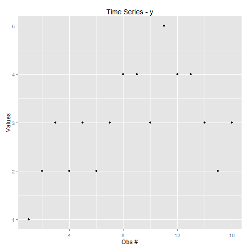

Homework 3
========================================================

Myeong Lee
--------------------------------------------------------


```r
options(contrasts = c("contr.sum", "contr.poly"))
data1 <- read.csv("C:/Users/myeong/Desktop/hw3.csv")

my.dat <- data1[, c("y", "Group")]
my.dat$Group <- factor(my.dat$Group, levels = c(1, 2, 3, 4))
```


## Part I

### 1. The model under investigation

$y_{i(j)} = \mu + \alpha_j + \varepsilon_{i(j)}$

### 2. H0

- $H_0: \alpha_j = 0$, $n\sigma_M^2 = \sigma^2$

- There is no systematic difference among the group means. All the groups have same means. 

### 3. H1

- $H_1: \alpha_j \neq 0$, $n\sigma_M^2 > \sigma^2$
  
- There are systematic differences among group means. 

### 4. Error Rate $\alpha$

- at $\alpha = 0.05$, critical t(2)=4.30
- actual $\alpha$ = 1 - $0.95^3$ = .142625
- $\frac{.142625}{4}$ = .0356 < .0.05
- So, alpha can be set as $\alpha = P(P|H_0) = 0.05$ 
  
### 5. ANOVA 

##### Fixed model

```r
fit1 <- y ~ Group
summary(aov(fit1, my.dat))
```

```
##             Df Sum Sq Mean Sq F value Pr(>F)  
## Group        3      8   2.667       4  0.035 *
## Residuals   12      8   0.667                 
## ---
## Signif. codes:  0 '***' 0.001 '**' 0.01 '*' 0.05 '.' 0.1 ' ' 1
```


```r
fit1.1 <- lm(y ~ Group, data = my.dat)
summary(fit1.1)
```

```
## 
## Call:
## lm(formula = y ~ Group, data = my.dat)
## 
## Residuals:
##    Min     1Q Median     3Q    Max 
##  -1.00  -0.25   0.00   0.25   1.00 
## 
## Coefficients:
##              Estimate Std. Error t value Pr(>|t|)    
## (Intercept)  3.00e+00   2.04e-01   14.70  4.9e-09 ***
## Group1      -1.00e+00   3.54e-01   -2.83    0.015 *  
## Group2      -4.53e-17   3.54e-01    0.00    1.000    
## Group3       1.00e+00   3.54e-01    2.83    0.015 *  
## ---
## Signif. codes:  0 '***' 0.001 '**' 0.01 '*' 0.05 '.' 0.1 ' ' 1
## 
## Residual standard error: 0.816 on 12 degrees of freedom
## Multiple R-squared:   0.5,	Adjusted R-squared:  0.375 
## F-statistic:    4 on 3 and 12 DF,  p-value: 0.0346
```


```r
anova(fit1.1)
```

```
## Analysis of Variance Table
## 
## Response: y
##           Df Sum Sq Mean Sq F value Pr(>F)  
## Group      3      8   2.667       4  0.035 *
## Residuals 12      8   0.667                 
## ---
## Signif. codes:  0 '***' 0.001 '**' 0.01 '*' 0.05 '.' 0.1 ' ' 1
```


##### Random model

```r
fit2 <- y ~ Error(Group)
summary(aov(fit2, my.dat))
```

```
## 
## Error: Group
##           Df Sum Sq Mean Sq F value Pr(>F)
## Residuals  3      8    2.67               
## 
## Error: Within
##           Df Sum Sq Mean Sq F value Pr(>F)
## Residuals 12      8   0.667
```


### 6. Plot

##### y - observation number

```r
library(ggplot2)
my.dat$e <- residuals(fit1.1)
my.dat$y.hat <- fitted(fit1.1)

qplot(1:nrow(my.dat), y, data = my.dat, main = "Time Series - y", xlab = "Obs #", 
    ylab = "Values")
```

 


##### e - observation number

```r
qplot(1:nrow(my.dat), e, data = my.dat, main = "Time Series - e", xlab = "Obs #", 
    ylab = "residuals")
```

 


### 7. Data frame

```r
frame1 <- data.frame(y = my.dat$y, y_hat = my.dat$y.hat, e = my.dat$e)
frame1
```

```
##    y y_hat          e
## 1  1     2 -1.000e+00
## 2  2     2 -2.498e-16
## 3  3     2  1.000e+00
## 4  2     2  1.943e-16
## 5  3     3  1.110e-16
## 6  2     3 -1.000e+00
## 7  3     3  1.110e-16
## 8  4     3  1.000e+00
## 9  4     4 -2.776e-17
## 10 3     4 -1.000e+00
## 11 5     4  1.000e+00
## 12 4     4 -2.776e-17
## 13 4     3  1.000e+00
## 14 3     3 -1.110e-16
## 15 2     3 -1.000e+00
## 16 3     3 -1.110e-16
```


### 8. Correlations


```r
library(xtable)

my.cor <- cor(frame1)
print(xtable(my.cor), type = "html")
```

<!-- html table generated in R 3.0.2 by xtable 1.7-1 package -->
<!-- Thu Mar 27 22:06:48 2014 -->
<TABLE border=1>
<TR> <TH>  </TH> <TH> y </TH> <TH> y_hat </TH> <TH> e </TH>  </TR>
  <TR> <TD align="right"> y </TD> <TD align="right"> 1.00 </TD> <TD align="right"> 0.71 </TD> <TD align="right"> 0.71 </TD> </TR>
  <TR> <TD align="right"> y_hat </TD> <TD align="right"> 0.71 </TD> <TD align="right"> 1.00 </TD> <TD align="right"> -0.00 </TD> </TR>
  <TR> <TD align="right"> e </TD> <TD align="right"> 0.71 </TD> <TD align="right"> -0.00 </TD> <TD align="right"> 1.00 </TD> </TR>
   </TABLE>


### 9. Pairwise plots

```r
library(GGally)
```

```
## Loading required package: reshape
## Loading required package: plyr
## 
## Attaching package: 'reshape'
## 
## The following objects are masked from 'package:plyr':
## 
##     rename, round_any
```

```r

ggpairs(frame1, lower = list(continuous = "smooth"))
```

 


### 10. Plot of the mean of y


```r
sub1 <- subset(my.dat, Group == 1)
sub1.mean <- mean(sub1$y)

sub2 <- subset(my.dat, Group == 2)
sub2.mean <- mean(sub2$y)

sub3 <- subset(my.dat, Group == 3)
sub3.mean <- mean(sub3$y)

sub4 <- subset(my.dat, Group == 4)
sub4.mean <- mean(sub4$y)

subtable <- data.frame(y = c(sub1.mean, sub2.mean, sub3.mean, sub4.mean), Group = c(1, 
    2, 3, 4))

qplot(1:nrow(subtable), y, data = subtable, main = "Means of y", xlab = "Group Membership Variable", 
    ylab = "Mean of y")
```

 


### 13. Interpretation

- Since F value is 4 on df(3,12) and p-value is .035, it rejects null hypothesis at $\alpha$= .05, but the significance is not that high.


## Part II

### 1. What is it?
- Compare each group to determine whether they are systematically differ, and to determine $\alpha$

### 2. Bonferroni


```r
mc.bonf <- with(my.dat, pairwise.t.test(y, Group, p.adj = "bonf"))
mc.bonf
```

```
## 
## 	Pairwise comparisons using t tests with pooled SD 
## 
## data:  y and Group 
## 
##   1     2     3    
## 2 0.653 -     -    
## 3 0.028 0.653 -    
## 4 0.653 1.000 0.653
## 
## P value adjustment method: bonferroni
```


### 3. Scheffe's


```r
library(agricolae)
mc.scheffe <- scheffe.test(aov(fit1, my.dat), "Group", group = FALSE, console = TRUE)
```

```
## 
## Study: aov(fit1, my.dat) ~ "Group"
## 
## Scheffe Test for y 
## 
## Mean Square Error  : 0.6667 
## 
## Group,  means
## 
##   y    std r Min Max
## 1 2 0.8165 4   1   3
## 2 3 0.8165 4   2   4
## 3 4 0.8165 4   3   5
## 4 3 0.8165 4   2   4
## 
## alpha: 0.05 ; Df Error: 12 
## Critical Value of F: 3.49 
## 
## Comparison between treatments means
## 
##       Difference  pvalue sig     LCL     UCL
## 1 - 2         -1 0.42622     -2.7989  0.7989
## 1 - 3         -2 0.03459   * -3.7989 -0.2011
## 1 - 4         -1 0.42622     -2.7989  0.7989
## 2 - 3         -1 0.42622     -2.7989  0.7989
## 2 - 4          0 1.00000     -1.7989  1.7989
## 3 - 4          1 0.42622     -0.7989  2.7989
```

```r
mc.scheffe$comparison
```

```
##       Difference  pvalue sig     LCL     UCL
## 1 - 2         -1 0.42622     -2.7989  0.7989
## 1 - 3         -2 0.03459   * -3.7989 -0.2011
## 1 - 4         -1 0.42622     -2.7989  0.7989
## 2 - 3         -1 0.42622     -2.7989  0.7989
## 2 - 4          0 1.00000     -1.7989  1.7989
## 3 - 4          1 0.42622     -0.7989  2.7989
```


### 4. Benefits

- Through Banferroni and Scheffe's test, I can see which groups are not different from each other. Since Scheffe's tests all possible pairs, it is good to see the differences. 


### 5. Difference between the two tests

- Scheffe's test is more conservative since it does multiple comparisons while Bonferroni does pairwise comparisons.

### 6. More interpretation

- Group 1 and 3 are somewhat systematically different, but other groups are not different that much (in a systematic manner). Significance levels are not that high.
