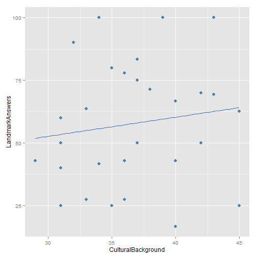
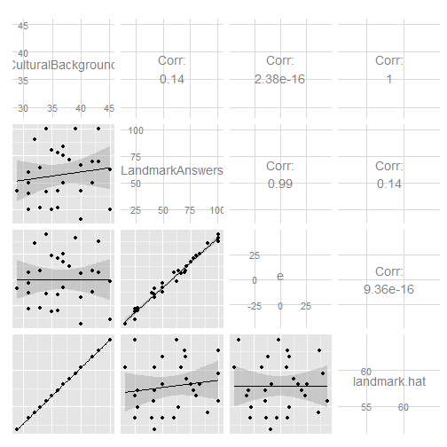

Pilot Test - How cultural background affects people's perception of new places?
========================================================

# The extent to which people know places VS. Answer correctness

```r
library(dplyr)
```

```
## 
## Attaching package: 'dplyr'
## 
## The following objects are masked from 'package:stats':
## 
##     filter, lag
## 
## The following objects are masked from 'package:base':
## 
##     intersect, setdiff, setequal, union
```

```r
data1 <- read.csv("C:/Users/myeong/Dropbox/Research/iConference2014/Pilot_test/fam-correct.csv")
group_by(data1, id)
```

```
## Source: local data frame [740 x 4]
## Groups: id
## 
##     id Familiarity Correctness Answer
## 1  285           1           0      i
## 2  285           1           0      0
## 3  285           4           0     12
## 4  285           7           0      h
## 5  285           1           0      a
## 6  286           1           0      a
## 7  286           1           0      m
## 8  286           1           1      m
## 9  286           2           1     18
## 10 288           5           1      a
## .. ...         ...         ...    ...
```

```r
my.dat <- with(data1, data.frame(Familiarity = Familiarity, Correctness = Correctness))
fit1 <- Familiarity ~ Correctness

summary(aov(fit1, my.dat))
```

```
##              Df Sum Sq Mean Sq F value  Pr(>F)    
## Correctness   1    183   183.0    32.7 1.6e-08 ***
## Residuals   738   4131     5.6                    
## ---
## Signif. codes:  0 '***' 0.001 '**' 0.01 '*' 0.05 '.' 0.1 ' ' 1
```


# Cultural Background and People's Perception of Places (When they recognize places)

```r
library(arm)
```

```
## Loading required package: MASS
## 
## Attaching package: 'MASS'
## 
## The following object is masked from 'package:dplyr':
## 
##     select
## 
## Loading required package: Matrix
## Loading required package: lme4
## Loading required package: lattice
## 
## arm (Version 1.6-10, built: 2013-11-15)
## 
## Working directory is C:/Users/myeong/git/psyc602
```

```r
library(ggplot2)
```

```
## 
## Attaching package: 'ggplot2'
## 
## The following object is masked from 'package:lme4':
## 
##     fortify
```

```r
library(GGally)
```

```
## Loading required package: reshape
## Loading required package: plyr
## 
## Attaching package: 'plyr'
## 
## The following objects are masked from 'package:dplyr':
## 
##     arrange, desc, failwith, id, mutate, summarise, summarize
## 
## 
## Attaching package: 'reshape'
## 
## The following objects are masked from 'package:plyr':
## 
##     rename, round_any
## 
## The following object is masked from 'package:Matrix':
## 
##     expand
```

```r
data2 <- read.csv("C:/Users/myeong/Dropbox/Research/iConference2014/Pilot_test/culture-landmark.csv")
my.dat2 <- with(data2, data.frame(CulturalBackground = Background, LandmarkAnswers = RecogRate))
my.dat21 <- na.omit(my.dat2)
fit2 <- lm(LandmarkAnswers ~ CulturalBackground, data = my.dat21)

summary(fit2)
```

```
## 
## Call:
## lm(formula = LandmarkAnswers ~ CulturalBackground, data = my.dat21)
## 
## Residuals:
##    Min     1Q Median     3Q    Max 
## -43.63 -14.38  -1.62  17.00  44.29 
## 
## Coefficients:
##                    Estimate Std. Error t value Pr(>|t|)
## (Intercept)          29.739     38.409    0.77     0.45
## CulturalBackground    0.764      1.038    0.74     0.47
## 
## Residual standard error: 24.9 on 27 degrees of freedom
## Multiple R-squared:  0.0197,	Adjusted R-squared:  -0.0167 
## F-statistic: 0.541 on 1 and 27 DF,  p-value: 0.468
```

```r


my.dat21$e = residuals(fit2)
my.dat21$landmark.hat = fitted(fit2)
p <- ggplot(aes(x = CulturalBackground, y = LandmarkAnswers), data = my.dat21) + 
    geom_point(color = "steelblue", size = 3)

p <- p + geom_smooth(method = "lm", se = FALSE)
p
```

 

```r

fit3 <- update(fit2, scale(LandmarkAnswers) ~ scale(CulturalBackground))
summary(fit3)
```

```
## 
## Call:
## lm(formula = scale(LandmarkAnswers) ~ scale(CulturalBackground), 
##     data = my.dat21)
## 
## Residuals:
##     Min      1Q  Median      3Q     Max 
## -1.7688 -0.5831 -0.0655  0.6890  1.7954 
## 
## Coefficients:
##                           Estimate Std. Error t value Pr(>|t|)
## (Intercept)               8.31e-17   1.87e-01    0.00     1.00
## scale(CulturalBackground) 1.40e-01   1.91e-01    0.74     0.47
## 
## Residual standard error: 1.01 on 27 degrees of freedom
## Multiple R-squared:  0.0197,	Adjusted R-squared:  -0.0167 
## F-statistic: 0.541 on 1 and 27 DF,  p-value: 0.468
```

```r

ggpairs(my.dat21, lower = list(continuous = "smooth"))
```

 


# Cultural Background and People's Guess of Places (When they don't recognize places)

```r
my.dat3 <- with(data2, data.frame(CulturalBackground = Background, LandmarkAnswers = GuessRate))
fit4 <- lm(LandmarkAnswers ~ CulturalBackground, data = my.dat3)

summary(fit4)
```

```
## 
## Call:
## lm(formula = LandmarkAnswers ~ CulturalBackground, data = my.dat3)
## 
## Residuals:
##    Min     1Q Median     3Q    Max 
## -43.25 -14.30   3.19  14.24  38.66 
## 
## Coefficients:
##                    Estimate Std. Error t value Pr(>|t|)
## (Intercept)         43.6959    34.5257    1.27     0.22
## CulturalBackground  -0.0144     0.9316   -0.02     0.99
## 
## Residual standard error: 22.4 on 28 degrees of freedom
## Multiple R-squared:  8.59e-06,	Adjusted R-squared:  -0.0357 
## F-statistic: 0.00024 on 1 and 28 DF,  p-value: 0.988
```

```r


my.dat3$e = residuals(fit4)
my.dat3$landmark.hat = fitted(fit4)
p <- ggplot(aes(x = CulturalBackground, y = LandmarkAnswers), data = my.dat3) + 
    geom_point(color = "steelblue", size = 3)

p <- p + geom_smooth(method = "lm", se = FALSE)
p
```

 

```r

fit5 <- update(fit4, scale(LandmarkAnswers) ~ scale(CulturalBackground))
summary(fit5)
```

```
## 
## Call:
## lm(formula = scale(LandmarkAnswers) ~ scale(CulturalBackground), 
##     data = my.dat3)
## 
## Residuals:
##    Min     1Q Median     3Q    Max 
## -1.964 -0.649  0.145  0.647  1.755 
## 
## Coefficients:
##                            Estimate Std. Error t value Pr(>|t|)
## (Intercept)               -1.25e-16   1.86e-01    0.00     1.00
## scale(CulturalBackground) -2.93e-03   1.89e-01   -0.02     0.99
## 
## Residual standard error: 1.02 on 28 degrees of freedom
## Multiple R-squared:  8.59e-06,	Adjusted R-squared:  -0.0357 
## F-statistic: 0.00024 on 1 and 28 DF,  p-value: 0.988
```


- y = 1.190 + 3.965X1


```r
ggpairs(my.dat3, lower = list(continuous = "smooth"))
```

 


