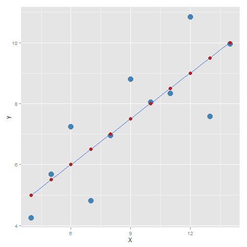

```r
my.dat <- with(anscombe, data.frame(X = x1, y = y1))
my.dat
```

```
##     X     y
## 1  10  8.04
## 2   8  6.95
## 3  13  7.58
## 4   9  8.81
## 5  11  8.33
## 6  14  9.96
## 7   6  7.24
## 8   4  4.26
## 9  12 10.84
## 10  7  4.82
## 11  5  5.68
```


## Population Equation
$y = \beta_0 + \beta_1 X + \eta$


##Null Hypothesis
$\beta_1 = 0$


##Regression

```r
fit1 <- lm(y ~ X, data = my.dat)
library(arm)
```

```
## Loading required package: MASS
## Loading required package: Matrix
## Loading required package: lme4
## Loading required package: lattice
## 
## arm (Version 1.6-10, built: 2013-11-15)
## 
## Working directory is C:/Users/myeong/git/psyc602
```

```r
display(fit1)
```

```
## lm(formula = y ~ X, data = my.dat)
##             coef.est coef.se
## (Intercept) 3.00     1.12   
## X           0.50     0.12   
## ---
## n = 11, k = 2
## residual sd = 1.24, R-Squared = 0.67
```

Two coeff: slope and intercept


```r
library(ggplot2)
```

```
## 
## Attaching package: 'ggplot2'
## 
## The following object is masked from 'package:lme4':
## 
##     fortify
```

```r
my.dat$e = residuals(fit1)
my.dat$y.hat = fitted(fit1)
qplot(1:nrow(my.dat), y, data = my.dat, main = "Time Series - y", xlab = "Obs #", 
    ylab = "Values")
```

 

```r
p <- ggplot(aes(x = X, y = y), data = my.dat) + geom_point(color = "steelblue", 
    size = 5)
p
```

 


### Adding regression line

```r
p <- p + geom_smooth(method = "lm", se = FALSE)
p
```

 


### Adding fitted values

```r
p <- p + geom_point(aes(x = X, y = y.hat), color = "firebrick", shape = 20, 
    size = 5)
p
```

 


## Analytically...


```r
dat2 <- data.frame(y = my.dat$y, X = my.dat$X)

mu.y <- mean(dat2$y)
mu.x <- mean(dat2$X)
mu.x
```

```
## [1] 9
```

```r
mu.y
```

```
## [1] 7.501
```

```r

dat2$d.y <- dat2$y - mu.y
dat2$d.X <- dat2$X - mu.x
dat2$d.X.sq <- dat2$d.X^2
dat2$d.Xy <- dat2$d.X * dat2$d.y
head(dat2)
```

```
##      y  X      d.y d.X d.X.sq    d.Xy
## 1 8.04 10  0.53909   1      1  0.5391
## 2 6.95  8 -0.55091  -1      1  0.5509
## 3 7.58 13  0.07909   4     16  0.3164
## 4 8.81  9  1.30909   0      0  0.0000
## 5 8.33 11  0.82909   2      4  1.6582
## 6 9.96 14  2.45909   5     25 12.2955
```

```r

SSD.X.sq <- sum(dat2$d.X.sq)
SSD.Xy <- sum(dat2$d.Xy)

b.1 <- SSD.Xy/SSD.X.sq
```

$b_1 = \frac{Cov[xy]}{Var[x]}$

### What about $b_0$


```r
b.0 <- mu.y - b.1 * mu.x
b.0
```

```
## [1] 3
```


### Fitted values and errors


```r

dat2$y.hat <- b.0 + b.1 * dat2$X
dat2$e <- dat2$y - dat2$y.hat
```


### Sums of Squares, MS, F-Test


```r
SSTot <- sum(dat2$d.y^2)
SSRes <- sum(dat2$e^2)
SSReg <- SSTot - SSRes

MSReg <- SSReg/1
MSRes <- SSRes/(nrow(dat2) - 2)

F.stat <- MSReg/MSRes
t.stat <- sqrt(F.stat)
F.stat
```

```
## [1] 17.99
```


### p-value: probability bigger than the given value
P(X>x) = 1-P(X<x)


```r
p.val <- 1 - pf(F.stat, 1, 9)
p.val
```

```
## [1] 0.00217
```


### Coefficient of Determination
What portion of variance does error account for


```r
SSRes/SSTot
```

```
## [1] 0.3335
```

$R^2$ in terms of the residuals

```r
R.sq <- 1 - SSRes/SSTot
```

This is equal to cor(dat2$y, dat2$y.hat)^2

### Comparing Results
####Coefficient


```r
coef(fit1)
```

```
## (Intercept)           X 
##      3.0001      0.5001
```

```r
coef(summary(fit1))
```

```
##             Estimate Std. Error t value Pr(>|t|)
## (Intercept)   3.0001     1.1247   2.667  0.02573
## X             0.5001     0.1179   4.241  0.00217
```

```r
c(b.0, b.1, t.stat)
```

```
## [1] 3.0001 0.5001 4.2415
```

####Fitted values

```r
round(fitted(fit1) - dat2$y.hat, digits = 10)
```

```
##  1  2  3  4  5  6  7  8  9 10 11 
##  0  0  0  0  0  0  0  0  0  0  0
```


#### F-test

```r
anova(fit1)
```

```
## Analysis of Variance Table
## 
## Response: y
##           Df Sum Sq Mean Sq F value Pr(>F)   
## X          1   27.5   27.51      18 0.0022 **
## Residuals  9   13.8    1.53                  
## ---
## Signif. codes:  0 '***' 0.001 '**' 0.01 '*' 0.05 '.' 0.1 ' ' 1
```

```r
c(SSReg, SSReg, SSTot)
```

```
## [1] 27.51 27.51 41.27
```

```r
c(MSReg, MSReg)
```

```
## [1] 27.51 27.51
```

```r
F.stat
```

```
## [1] 17.99
```


