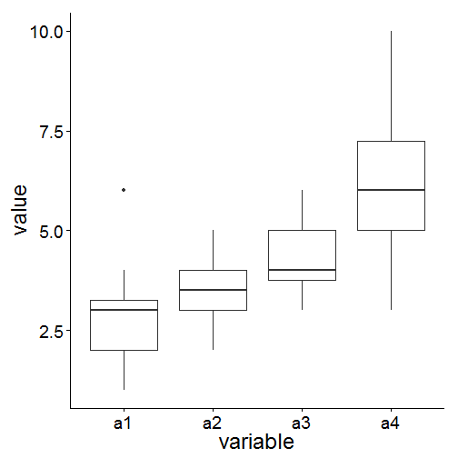
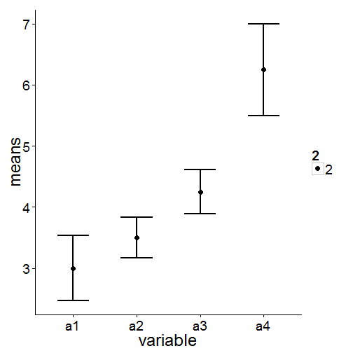
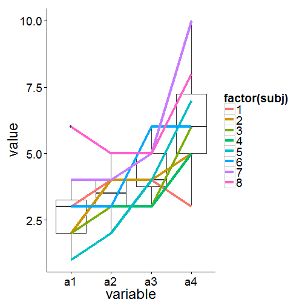

Lab 6 (4/3)
========================================================

# Randomized block?
- Repeated measure - single person is a block.
- Subjects controlling variance themselves
- Concepts mostly coming from Kirk book.

# Randomized block RB-p
- ANOVA model: $Y_{ij} = \mu + \alpha_j + \pi_i + \epsilon_{ij}$
- $\mu = GM$
- $\alpha_j = \mu_{.j} - \mu$
- $\pi_i = \mu_{i.} - \mu$: the number of blocks (n). Random variable, normal distribution. 0 mean.
- $\epsilon_{ij} = Y_{ij} - \mu_{.j} - \mu_{i.} + \mu$

# SS's
- $SS_{total} = SS_A + SS_{Block} + SS_{RES}$
- $SS_{total} = [Y_{ij} - \bar{Y_{..}}]^2$

# Hypotheses
## Treatment A
- H0: $\alpha_j = 0 for all j$
- H1: not H0
- F = MS_a / MS_res = SSA/(p-1) / SSres/(n-1)(p-1)

## Block
- H0: $\alpha_{\pi}^2 = 0$
- H1: $\alpha_{\pi}^2 \neq 0$
- F = MS_block / MS_res = SS_block/(n-1) / ...

# Data
- 4 Altimeters
- Fixed. 
- Conceptually if fixed 
  - What's the level of drug's power
  - if random - Does it work?
  

```r
my.data <- read.csv("C:/Users/myeong/Desktop/alt.csv")
my.data
```

```
##   subj a1 a2 a3 a4
## 1    1  3  4  4  3
## 2    2  2  4  4  5
## 3    3  2  3  3  6
## 4    4  3  3  3  5
## 5    5  1  2  4  7
## 6    6  3  3  6  6
## 7    7  4  4  5 10
## 8    8  6  5  5  8
```


- If subj is number, it means something. It should be factor.

## Data format

```r
library(reshape2)
options(contrasts = c("contr.sum", "contr.poly"))  #this gives a same result to SPSS, sum to 0.

my.data <- melt(my.data, id.vars = "subj", variable.name = "altimeter", value.name = "readability")  # aggregate all data to a single column.
head(my.data)
```

```
##   subj altimeter readability
## 1    1        a1           3
## 2    2        a1           2
## 3    3        a1           2
## 4    4        a1           3
## 5    5        a1           1
## 6    6        a1           3
```


## Fit CR (Completely Randomized) Model
- No block anymore. $\pi$ part would be taken out.
- Don't care about subj.

### Fit

```r
mod.cr <- lm(readability ~ altimeter, my.data)
```


### ANOVA

```r
anova(mod.cr)
```

```
## Analysis of Variance Table
## 
## Response: readability
##           Df Sum Sq Mean Sq F value  Pr(>F)    
## altimeter  3     49   16.33     7.5 0.00078 ***
## Residuals 28     61    2.18                    
## ---
## Signif. codes:  0 '***' 0.001 '**' 0.01 '*' 0.05 '.' 0.1 ' ' 1
```


## Fit RB (Randomized Block) Model
- subj is regarded as error here.

### Fit

```r
my.data$subj <- factor(my.data$subj)
mod.rb <- lm(readability ~ altimeter + subj, my.data)
anova(mod.rb)
```

```
## Analysis of Variance Table
## 
## Response: readability
##           Df Sum Sq Mean Sq F value  Pr(>F)    
## altimeter  3   49.0    16.3    11.6 0.00011 ***
## subj       7   31.5     4.5     3.2 0.01802 *  
## Residuals 21   29.5     1.4                    
## ---
## Signif. codes:  0 '***' 0.001 '**' 0.01 '*' 0.05 '.' 0.1 ' ' 1
```


### ANOVA

```r
anova(mod.rb)
```

```
## Analysis of Variance Table
## 
## Response: readability
##           Df Sum Sq Mean Sq F value  Pr(>F)    
## altimeter  3   49.0    16.3    11.6 0.00011 ***
## subj       7   31.5     4.5     3.2 0.01802 *  
## Residuals 21   29.5     1.4                    
## ---
## Signif. codes:  0 '***' 0.001 '**' 0.01 '*' 0.05 '.' 0.1 ' ' 1
```


# Interaction?

```r
mod.full <- lm(readability ~ altimeter * subj, my.data)
anova(mod.full)
```

```
## Warning: ANOVA F-tests on an essentially perfect fit are unreliable
```

```
## Analysis of Variance Table
## 
## Response: readability
##                Df Sum Sq Mean Sq F value Pr(>F)
## altimeter       3   49.0    16.3               
## subj            7   31.5     4.5               
## altimeter:subj 21   29.5     1.4               
## Residuals       0    0.0
```

```r
my.data
```

```
##    subj altimeter readability
## 1     1        a1           3
## 2     2        a1           2
## 3     3        a1           2
## 4     4        a1           3
## 5     5        a1           1
## 6     6        a1           3
## 7     7        a1           4
## 8     8        a1           6
## 9     1        a2           4
## 10    2        a2           4
## 11    3        a2           3
## 12    4        a2           3
## 13    5        a2           2
## 14    6        a2           3
## 15    7        a2           4
## 16    8        a2           5
## 17    1        a3           4
## 18    2        a3           4
## 19    3        a3           3
## 20    4        a3           3
## 21    5        a3           4
## 22    6        a3           6
## 23    7        a3           5
## 24    8        a3           5
## 25    1        a4           3
## 26    2        a4           5
## 27    3        a4           6
## 28    4        a4           5
## 29    5        a4           7
## 30    6        a4           6
## 31    7        a4          10
## 32    8        a4           8
```


# Turkey's 1-df Test for Non-additivity

```r
library(asbio)
```

```
## Warning: package 'asbio' was built under R version 3.0.3
```

```
## Loading required package: tcltk
```

```r
tukey.add.test(my.data$readability, my.data$subj, my.data$altimeter)
```

```
## 
## Tukey's one df test for additivity 
## F = 1.2796   Denom df = 20    p-value = 0.2714
```


# Standard Errors

```r
dat <- read.csv("C:/Users/myeong/Desktop/alt.csv")
summary(dat)
```

```
##       subj            a1             a2            a3      
##  Min.   :1.00   Min.   :1.00   Min.   :2.0   Min.   :3.00  
##  1st Qu.:2.75   1st Qu.:2.00   1st Qu.:3.0   1st Qu.:3.75  
##  Median :4.50   Median :3.00   Median :3.5   Median :4.00  
##  Mean   :4.50   Mean   :3.00   Mean   :3.5   Mean   :4.25  
##  3rd Qu.:6.25   3rd Qu.:3.25   3rd Qu.:4.0   3rd Qu.:5.00  
##  Max.   :8.00   Max.   :6.00   Max.   :5.0   Max.   :6.00  
##        a4       
##  Min.   : 3.00  
##  1st Qu.: 5.00  
##  Median : 6.00  
##  Mean   : 6.25  
##  3rd Qu.: 7.25  
##  Max.   :10.00
```

```r

# First reshape
dat1 <- melt(dat, id.var = "subj")
summary(dat1)
```

```
##       subj      variable     value      
##  Min.   :1.00   a1:8     Min.   : 1.00  
##  1st Qu.:2.75   a2:8     1st Qu.: 3.00  
##  Median :4.50   a3:8     Median : 4.00  
##  Mean   :4.50   a4:8     Mean   : 4.25  
##  3rd Qu.:6.25            3rd Qu.: 5.00  
##  Max.   :8.00            Max.   :10.00
```

```r

# Boxplots are easy/informative
require(ggplot2)
```

```
## Loading required package: ggplot2
```

```r
qplot(variable, value, data = dat1, geom = "boxplot") + theme_classic(base_size = 24)
```

 

```r

# Second reshape
require(plyr)
```

```
## Loading required package: plyr
```

```r
dat2 <- ddply(dat1, .(variable), summarise, means = mean(value), ses = sd(value)/sqrt(length(value)))  #standard errors
summary(dat2)
```

```
##  variable     means           ses       
##  a1:1     Min.   :3.00   Min.   :0.327  
##  a2:1     1st Qu.:3.38   1st Qu.:0.356  
##  a3:1     Median :3.88   Median :0.450  
##  a4:1     Mean   :4.25   Mean   :0.494  
##           3rd Qu.:4.75   3rd Qu.:0.588  
##           Max.   :6.25   Max.   :0.750
```

```r

# Error bars are also appropriate
qplot(variable, means, data = dat2, size = 2) + geom_errorbar(aes(ymin = means - 
    ses, ymax = means + ses), width = 0.5, size = 1) + theme_classic(base_size = 24)
```

 

```r

# Other interesting possibilities, called spagetti plot
qplot(variable, value, data = dat1, geom = "boxplot") + geom_line(aes(color = factor(subj), 
    group = factor(subj)), size = 1.5) + theme_classic(base_size = 24)
```

 


