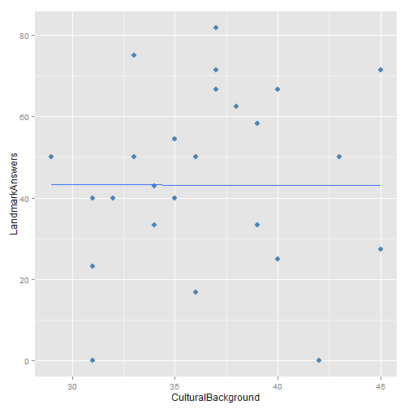

Lab 1
========================================================

#### Create Data

```r
data(anscombe)
my.data <- anscombe[, c("y1", "x1")]
summary(my.data)
```

```
##        y1              x1      
##  Min.   : 4.26   Min.   : 4.0  
##  1st Qu.: 6.32   1st Qu.: 6.5  
##  Median : 7.58   Median : 9.0  
##  Mean   : 7.50   Mean   : 9.0  
##  3rd Qu.: 8.57   3rd Qu.:11.5  
##  Max.   :10.84   Max.   :14.0
```


### Simple Regression

This is a simple regression


```r
fit1 <- lm(y1 ~ x1, data = my.data)
fit1
```

```
## 
## Call:
## lm(formula = y1 ~ x1, data = my.data)
## 
## Coefficients:
## (Intercept)           x1  
##         3.0          0.5
```

```r
summary(fit1)
```

```
## 
## Call:
## lm(formula = y1 ~ x1, data = my.data)
## 
## Residuals:
##     Min      1Q  Median      3Q     Max 
## -1.9213 -0.4558 -0.0414  0.7094  1.8388 
## 
## Coefficients:
##             Estimate Std. Error t value Pr(>|t|)   
## (Intercept)    3.000      1.125    2.67   0.0257 * 
## x1             0.500      0.118    4.24   0.0022 **
## ---
## Signif. codes:  0 '***' 0.001 '**' 0.01 '*' 0.05 '.' 0.1 ' ' 1
## 
## Residual standard error: 1.24 on 9 degrees of freedom
## Multiple R-squared:  0.667,	Adjusted R-squared:  0.629 
## F-statistic:   18 on 1 and 9 DF,  p-value: 0.00217
```

```r

fit2 <- update(fit1, scale(y1) ~ scale(x1))
summary(fit2)
```

```
## 
## Call:
## lm(formula = scale(y1) ~ scale(x1), data = my.data)
## 
## Residuals:
##     Min      1Q  Median      3Q     Max 
## -0.9457 -0.2243 -0.0204  0.3492  0.9051 
## 
## Coefficients:
##              Estimate Std. Error t value Pr(>|t|)   
## (Intercept) -1.67e-17   1.84e-01    0.00   1.0000   
## scale(x1)    8.16e-01   1.92e-01    4.24   0.0022 **
## ---
## Signif. codes:  0 '***' 0.001 '**' 0.01 '*' 0.05 '.' 0.1 ' ' 1
## 
## Residual standard error: 0.609 on 9 degrees of freedom
## Multiple R-squared:  0.667,	Adjusted R-squared:  0.629 
## F-statistic:   18 on 1 and 9 DF,  p-value: 0.00217
```


# Question 5


```r
library(ggplot2)

my.data$e <- residuals(fit1)
my.data$y.hat <- fitted(fit1)

qplot(1:nrow(my.data), y1, data = my.data, main = "Time Series - y1", xlab = "Obs #", 
    ylab = "Values")
```

 

```r

```


```r
library(xtable)

my.cor <- cor(my.data)
print(xtable(my.cor), type = "html")
```

<!-- html table generated in R 3.0.2 by xtable 1.7-1 package -->
<!-- Thu Feb 06 23:11:01 2014 -->
<TABLE border=1>
<TR> <TH>  </TH> <TH> y1 </TH> <TH> x1 </TH> <TH> e </TH> <TH> y.hat </TH>  </TR>
  <TR> <TD align="right"> y1 </TD> <TD align="right"> 1.00 </TD> <TD align="right"> 0.82 </TD> <TD align="right"> 0.58 </TD> <TD align="right"> 0.82 </TD> </TR>
  <TR> <TD align="right"> x1 </TD> <TD align="right"> 0.82 </TD> <TD align="right"> 1.00 </TD> <TD align="right"> 0.00 </TD> <TD align="right"> 1.00 </TD> </TR>
  <TR> <TD align="right"> e </TD> <TD align="right"> 0.58 </TD> <TD align="right"> 0.00 </TD> <TD align="right"> 1.00 </TD> <TD align="right"> -0.00 </TD> </TR>
  <TR> <TD align="right"> y.hat </TD> <TD align="right"> 0.82 </TD> <TD align="right"> 1.00 </TD> <TD align="right"> -0.00 </TD> <TD align="right"> 1.00 </TD> </TR>
   </TABLE>


```r
library(GGally)
```

```
## Loading required package: reshape
## Loading required package: plyr
## 
## Attaching package: 'reshape'
## 
## The following objects are masked from 'package:plyr':
## 
##     rename, round_any
```

```r

ggpairs(my.data, lower = list(continuous = "smooth"))
```

 

```r

```


##### Lab 2


```r
fit1 <- lm(y ~ x1 + x2)
```

```
## Error: object 'y' not found
```

```r
update(fit1, scale(y) ~ scacle(x1) + scale(x2))
```

```
## Error: object 'y' not found
```


